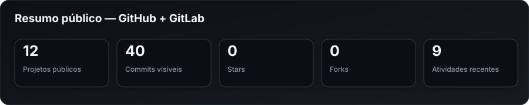
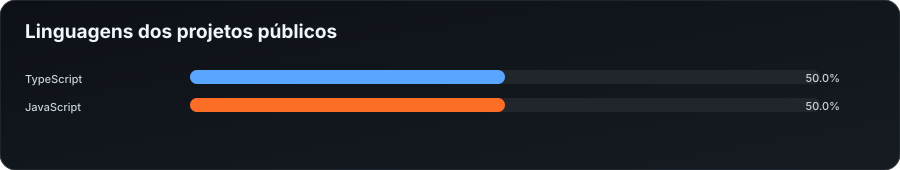
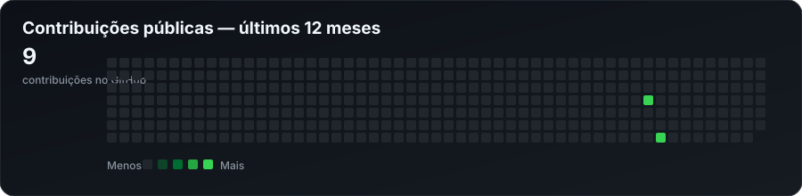

# Marcus Vinicius

### Software Engineer • Analista de Implantação • DevOps & Integrações

Desenvolvo plataformas, APIs, integrações e automações para transformar operações complexas em sistemas confiáveis, observáveis e fáceis de manter.

## Sobre mim

- Trabalho entre **desenvolvimento, implantação, infraestrutura e operação**.
- Construo soluções com **Node.js, TypeScript, React, PostgreSQL, Oracle e Docker**.
- Tenho experiência com APIs, filas, CI/CD, observabilidade, bancos relacionais e ambientes Linux.
- Gosto de resolver problemas que exigem entendimento técnico e visão do processo inteiro.
- Este perfil reúne automaticamente meus projetos e atividades públicas do GitHub e GitLab.

## Atuação

| Área | O que faço |
|---|---|
| Desenvolvimento | APIs REST, dashboards, aplicações web, automações e ferramentas internas |
| Implantação | Análise técnica, configuração de ambientes, troubleshooting e acompanhamento de produção |
| Integrações | Bancos, mensageria, serviços externos, arquivos, webhooks e sistemas legados |
| DevOps | Docker, pipelines, proxy reverso, métricas, logs e gestão de ambientes |

## Stack

### Backend

### Frontend e Mobile

### Dados e infraestrutura

## Atividade e estatísticas

<!-- AUTO:SUMMARY:START -->

<!-- AUTO:SUMMARY:END -->

<!-- AUTO:LANGUAGES:START -->

<!-- AUTO:LANGUAGES:END -->

<!-- AUTO:CONTRIBUTIONS:START -->

<!-- AUTO:CONTRIBUTIONS:END -->

> Os números acima são gerados pelas APIs públicas das duas plataformas. Atividade privada não é exposta.

## Projetos públicos em destaque

<!-- AUTO:PROJECTS:START -->
### [ledgerguard](https://github.com/Tito174BR/ledgerguard)

Plataforma SaaS de ledger, conciliação financeira e antifraude explicável.

`TypeScript` • ⭐ 0 • ⑂ 0 • Atualizado em 01 de ago. de 2026

[Código](https://github.com/Tito174BR/ledgerguard)

---

### [integraflow](https://github.com/Tito174BR/integraflow)

Plataforma iPaaS multi-tenant para criação, execução e monitoramento de integrações corporativas.

`TypeScript` • ⭐ 0 • ⑂ 0 • Atualizado em 01 de ago. de 2026

[Código](https://github.com/Tito174BR/integraflow)

---

### [implantahub](https://github.com/Tito174BR/implantahub)

Projeto público mantido por Marcus Vinicius.

`TypeScript` • ⭐ 0 • ⑂ 0 • Atualizado em 27 de jul. de 2026

[Código](https://github.com/Tito174BR/implantahub)

---

### [Codebase Typescript](https://gitlab.com/Tito174BR/codebase_typescript)

Projeto público mantido por Marcus Vinicius.

`TypeScript` • ⭐ 0 • ⑂ 0 • Atualizado em 09 de dez. de 2024

[Código](https://gitlab.com/Tito174BR/codebase_typescript)

---

### [Coffee Delivery](https://gitlab.com/Tito174BR/coffee_delivery)

Projeto público mantido por Marcus Vinicius.

`JavaScript` • ⭐ 0 • ⑂ 0 • Atualizado em 29 de nov. de 2024

[Código](https://gitlab.com/Tito174BR/coffee_delivery)

---

### [xr](https://github.com/Tito174BR/xr)

Projeto público mantido por Marcus Vinicius.

`HTML` • ⭐ 0 • ⑂ 0 • Atualizado em 21 de out. de 2022

`hacktoberfest` `hacktoberfest-accepted` `hacktoberfest2022`

[Código](https://github.com/Tito174BR/xr)

---

### [tipagem_sanguinea](https://github.com/Tito174BR/tipagem_sanguinea)

Projeto público mantido por Marcus Vinicius.

`HTML` • ⭐ 0 • ⑂ 0 • Atualizado em 15 de set. de 2022

[Código](https://github.com/Tito174BR/tipagem_sanguinea)

---

### [matt](https://github.com/Tito174BR/matt)

Projeto público mantido por Marcus Vinicius.

⭐ 0 • ⑂ 0 • Atualizado em 06 de ago. de 2022

[Código](https://github.com/Tito174BR/matt)
<!-- AUTO:PROJECTS:END -->

## Atividade pública recente

<!-- AUTO:ACTIVITY:START -->
- **01 de ago. de 2026 · GitHub:** [Criou branch main](https://github.com/Tito174BR/ledgerguard) em **Tito174BR/ledgerguard**
- **01 de ago. de 2026 · GitHub:** [Criou branch main](https://github.com/Tito174BR/integraflow) em **Tito174BR/integraflow**
- **22 de jul. de 2026 · GitHub:** [Enviou 0 commit(s)](https://github.com/Tito174BR/implantahub) em **Tito174BR/implantahub**
- **22 de jul. de 2026 · GitHub:** [Criou branch main](https://github.com/Tito174BR/implantahub) em **Tito174BR/implantahub**
- **22 de jul. de 2026 · GitHub:** [Criou branch main](https://github.com/Tito174BR/Tito174BR) em **Tito174BR/Tito174BR**
- **09 de dez. de 2024 · GitLab:** pushed new Codebase Typescript em **Projeto #65234844**
- **09 de dez. de 2024 · GitLab:** created Codebase Typescript em **Projeto #65234844**
- **29 de nov. de 2024 · GitLab:** pushed new Coffee Delivery em **Projeto #64952694**
- **29 de nov. de 2024 · GitLab:** created Coffee Delivery em **Projeto #64952694**
<!-- AUTO:ACTIVITY:END -->

## Foco atual

- Plataformas SaaS e portais operacionais.
- Integrações entre aplicações, bancos e dispositivos.
- Monitoramento de pipelines, deploys e ambientes.
- Automação de rotinas técnicas e relatórios.
- Evolução do portfólio em `mvtech.dev.br`.

## Contato

- GitHub: [github.com/Tito174BR](https://github.com/Tito174BR)
- GitLab: [gitlab.com/Tito174BR](https://gitlab.com/Tito174BR)
- Portfólio: [mvtech.dev.br](https://mvtech.dev.br)

---

<!-- AUTO:UPDATED:START -->
Última sincronização pública: **19 de agosto de 2026 às 04:09**.
<!-- AUTO:UPDATED:END -->

